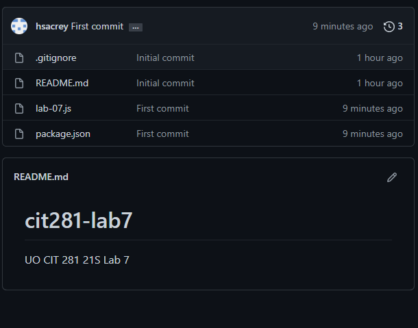

## Lab 7

In this lab, I created CustomError objects and uploaded the files to a GitHub repo for the first time.

I also used try, catch, finally for errors.

#### lab-07.js:
```javascript
/*
    CIT 281: Lab 07
    Hunter Sacrey
*/
class CustomError extends Error {}

throwGenericError = () => {
  throw new Error("Generic error");
};

throwCustomError = () => {
  throw new CustomError("Custom Error");
};

console.log("Force generic error");
try {
  throwGenericError();
  console.log("Generic Error try block");
} catch (err) {
  console.log(err + " ");
  console.log("Generic Error catch block");
} finally {
  console.log("Generic Error finally block");
}

console.log("Force custom error");
try {
  throwCustomError();
  console.log("Custom Error try block");
} catch (err) {
  console.log(err + " ");
  console.log("Custom Error catch block");
} 
finally {
  console.log("Custom Error finally block");
}
```
#### GitHub Repo:

